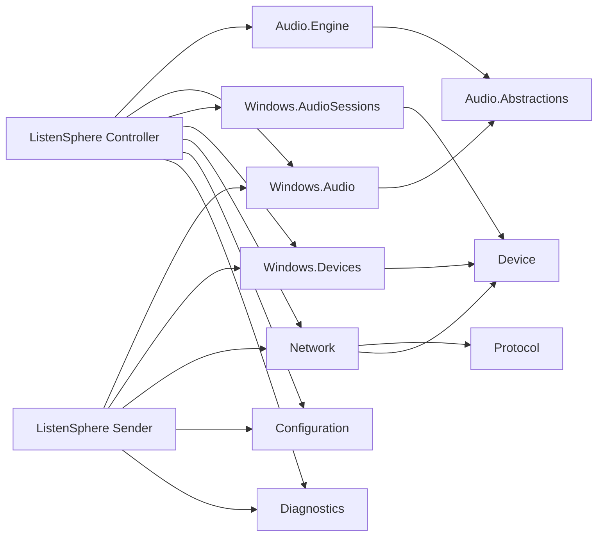
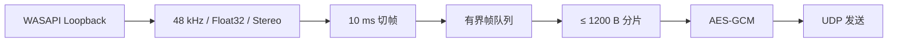

# 聆界（ListenSphere）P0 架构说明

## 1. 本阶段目标

P0 负责固定边界，而不是提前实现产品功能。交付物包括可编译解决方案、平台无关公共契约、ListenSphere Protocol v1 草案、模块与线程模型、风险清单，以及可直接执行的 P1 技术验证计划。

明确不在 P0 实现：可用音频捕获/播放、网络发现、配对服务、完整 WPF 界面、场景持久化、移动端、Opus、虚拟声卡、驱动和任何形式的云服务。

## 2. 当前状态与技术限制

- 仓库从空目录建立，产品和程序集统一使用 `ListenSphere`，中文界面品牌使用“聆界”。
- Windows 主控端只能调节 Windows 已存在的 Audio Session；这不等于独立捕获或混合每个应用的 PCM。
- 远程音频由主控端输出到所选 WASAPI 设备；主控端不能替本机所有应用迁移输出设备。
- WASAPI Loopback 不保证捕获受保护内容、独占模式音频或特殊驱动路径。
- Android、iOS 和 macOS 的系统音频捕获均受平台权限和内容保护限制，P0 不创建这些平台的工程。
- 48 kHz、双声道 Float32 PCM 每 10 ms 为 3,840 字节，超过安全 UDP 数据报预算，必须进行应用层分片。

## 3. 模块边界和依赖



约束：

1. `Audio.Abstractions`、`Audio.Engine`、`Network`、`Protocol`、`Device`、`Configuration` 和 `Diagnostics` 目标为 `net10.0`。
2. 平台无关核心不得引用 WPF、NAudio、COM、P/Invoke 或 `ListenSphere.Windows.*`。
3. Windows 适配器和应用目标为 `net10.0-windows`、x64。
4. View 只负责显示与交互；业务编排进入 ViewModel/服务，实时音频状态通过低频快照送往 UI。
5. 协议源以 `.proto` 和音频包规范为准，C# 类型只是生成物或适配模型。

## 4. 项目目录

```text
listen-sphere/
├── apps/
│   ├── ListenSphere.Controller/
│   └── ListenSphere.Sender/
├── src/
│   ├── ListenSphere.Audio.Abstractions/
│   ├── ListenSphere.Audio.Engine/
│   ├── ListenSphere.Configuration/
│   ├── ListenSphere.Device/
│   ├── ListenSphere.Diagnostics/
│   ├── ListenSphere.Network/
│   ├── ListenSphere.Protocol/
│   ├── ListenSphere.Windows.Audio/
│   ├── ListenSphere.Windows.AudioSessions/
│   └── ListenSphere.Windows.Devices/
├── protocol/
│   ├── protobuf/listensphere/v1/
│   └── test-vectors/
├── tests/
│   ├── ListenSphere.Architecture.Tests/
│   ├── ListenSphere.Core.Tests/
│   ├── ListenSphere.Protocol.Tests/
│   └── ListenSphere.Windows.TechnicalTests/
└── docs/
    ├── architecture/
    ├── protocol/
    └── development/
```

移动端目录在对应阶段开始时创建；P0 仅保证协议和核心边界可由 Kotlin、Swift、C++ 或 Rust 重新实现。

## 5. 线程模型

| 执行上下文 | 职责 | 允许的通信 | 禁止事项 |
|---|---|---|---|
| WPF Dispatcher | 命令、绑定、低频状态快照 | 异步命令、不可变快照 | 音频处理、阻塞 I/O |
| 应用编排线程池 | 生命周期、配置、配对流程 | `Task`、取消令牌 | 长时间占用线程 |
| WASAPI 捕获回调 | 获取捕获缓冲并复制到池化帧 | 有界 SPSC 队列 | UI、日志、网络、分配大对象 |
| 网络发送循环 | 分片、AEAD、UDP 发送 | 有界队列 | 回调线程内同步发送 |
| UDP 接收循环 | 长度校验、解密、去重、重组 | 有界队列 | 将未验证数据交给音频线程 |
| 抖动/混音/播放循环 | 定时出队、增益、混音、WASAPI 写入 | 预分配缓冲、原子统计 | 磁盘、配置、长锁、弹窗 |
| Audio Session COM 上下文 | 枚举与监听 Windows 会话 | 状态快照 | 操作 WPF 控件 |
| 日志与诊断后台 | 结构化日志、统计聚合、导出 | 有界日志通道 | 保存真实音频或密钥 |

所有生产队列必须有容量和明确的溢出策略。音频发送拥塞时丢弃最旧的未发送帧以限制延迟；播放端缺帧时输出静音并计数，不阻塞等待。

## 6. 音频与网络数据流

发送端：



主控端：


控制数据与音频数据分离。TCP/TLS 控制通道承担身份、配对、心跳、能力协商、会话密钥和流生命周期；UDP 仅接收已认证会话的音频数据报。

本机应用仍由 Windows 音频引擎混合。主音量对应选定输出端点的系统主音量；远程声道音量在 ListenSphere 混音器内应用。

## 7. 风险清单

| 风险 | 影响 | P0/P1 应对 |
|---|---|---|
| 时钟漂移 | 缓冲持续增减、延迟累积 | 记录发送/接收采样时钟；P4 引入占用率反馈和轻量重采样 |
| UDP 丢包与乱序 | 爆音、缺帧 | 包序号、帧序号、分片号、有限重组窗口、静音补偿 |
| PCM 带宽高 | 多设备时网络压力增加 | 1200 字节分片；先验证 PCM，稳定后再评估 Opus |
| 首次配对中间人 | 设备身份可能被替换 | 临时 TLS、一次性验证码、指纹固定；明确可信局域网剩余风险 |
| 设备热插拔 | 播放停止或 COM 异常 | 所有 Windows 适配器可重建；P6 验证恢复状态机 |
| 配置损坏 | 应用无法启动 | 版本字段、原子替换、损坏文件隔离和默认恢复 |
| 实时线程阻塞 | 卡顿、爆音 | 预分配、有界队列、无磁盘/UI/阻塞网络调用 |
| 应用会话身份不稳定 | 重启后错误映射 | 组合进程、会话标识和显示元数据；不把 PID 作为永久 ID |
| 防火墙与 mDNS 受限 | 自动发现失败 | 提供明确提示和高级手动 IP 备用入口 |

## 8. P0 验收方法

1. 使用 .NET 10 SDK 执行 Release restore、build 和 test，要求零错误、零警告。
2. 启动两个 x64 WPF 空壳，检查中文品牌、英文端名、DI 和日志生命周期。
3. 架构测试证明平台无关程序集不引用 WPF、NAudio 或 Windows 适配程序集。
4. 协议测试验证固定包头、版本拒绝、长度错误、分片、序号边界、AEAD 篡改和 Protobuf 未知字段。
5. 对仓库执行命名扫描，不允许出现废弃项目名。

