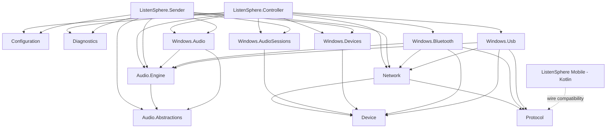

# ListenSphere R0 架构治理基线报告

日期：2026-08-30  
基线分支：`main`  
基线提交：`fac50b3f3ee97bd9248bc02c967c359d32979db9`

## 1. 阶段结论

R0 仅建立可复现基线、清理仓库卫生并记录后续计划，没有修改业务代码、协议、配置格式或 UI。Windows 和 Android 自动验证均通过。

## 2. 工具链

| 项目 | 基线 |
| --- | --- |
| .NET SDK | 10.0.302（`global.json`，禁用预览） |
| C# | 14.0，nullable、隐式 using、警告即错误 |
| JDK | 17.0.16（Android 构建显式使用；系统默认 JDK 21 不参与） |
| Android | compileSdk/targetSdk 34，minSdk 29 |
| Gradle | 8.10.2 |
| Android Gradle Plugin | 8.4.0 |
| Kotlin | 2.0.0 |

解决方案包含 18 个 .NET 项目；Android 保持独立 Kotlin/Gradle 工程。

## 3. 仓库卫生

清理前 Git 跟踪了：

- `apps/ListenSphere.Controller/ListenSphere.Controller_oqns4qax_wpftmp.csproj`

处理：

- 删除该 WPF 临时项目。
- `.gitignore` 新增 `*_wpftmp.csproj`。
- 复扫 `bin/`、`obj/`、`*.apk`、`*.log`、`.idea/`、`.vs/` 和 `*_wpftmp.csproj`。

除本次待提交的删除项外，没有发现其他被跟踪的构建产物、APK、日志或 IDE 临时文件。正常本地缓存保留且继续被忽略。

## 4. Windows 构建与测试

执行：

```powershell
dotnet restore ListenSphere.sln
dotnet build ListenSphere.sln -c Release --no-restore -m:1
dotnet test ListenSphere.sln -c Release --no-build -m:1 --logger trx --results-directory TestResults/R0/dotnet
```

结果：

| 测试项目 | 通过 | 失败 | 跳过 |
| --- | ---: | ---: | ---: |
| Architecture | 2 | 0 | 0 |
| Core | 48 | 0 | 0 |
| Protocol | 10 | 0 | 0 |
| Windows Technical | 20 | 0 | 0 |
| **合计** | **80** | **0** | **0** |

Release build：0 警告、0 错误。原始 build/test 日志及 4 份 TRX 保存在本地 `TestResults/R0/`，该目录不进入 Git。

## 5. Android 构建与测试

为规避仓库中文路径问题，构建期间临时映射 `L:`；构建结束后已移除。显式使用 JDK 17、SDK 34 和本地 Gradle 8.10.2：

```text
gradle assembleDebug testDebugUnitTest --no-daemon
```

结果：

- Gradle：`BUILD SUCCESSFUL`，42 个任务完成。
- 单元测试：23 通过，0 失败，0 错误，0 跳过。
- APK：`apps/ListenSphere.Mobile/app/build/outputs/apk/debug/app-debug.apk`
- APK 大小：55,786,252 字节。
- APK SHA-256：`669F01073524579CD06AC7895D711F1B1659CECD3A473CE05ED9B784697CA919`
- APK 和 Gradle 产物未加入 Git。

非阻塞警告：`android.overridePathCheck=true` 仍为实验选项；当前 command-line tools 只理解 SDK XML v3，但检测到 v4。R0 不调整工具链版本。

## 6. 超大源码清单

阈值为 25 KB，排除生成目录和测试代码：

| 文件 | 字节 | 行数 |
| --- | ---: | ---: |
| `ControllerNetworkViewModel.cs` | 183,526 | 4,871 |
| `MainWindow.xaml` | 178,400 | 2,307 |
| `ControlChannel.cs` | 49,112 | 1,280 |
| `ControllerViewModel.cs` | 47,870 | 1,328 |
| Sender `MainWindow.xaml` | 45,371 | 727 |
| `SenderViewModel.cs` | 43,832 | 1,224 |
| Android `ListenSphereScreen.kt` | 43,384 | 969 |
| `BluetoothRfcommProbeHost.cs` | 32,492 | 826 |
| Android `AudioStreamingService.kt` | 29,778 | 663 |
| `UdpAudioTransport.cs` | 27,565 | 840 |

R1/R2 优先治理前三个 Controller 文件；其他文件由 R6/R7 或后续独立阶段处理。

## 7. 当前项目依赖图



测试项目只引用被测程序集，不进入产品运行时依赖。当前核心方向符合 P0 原则，但 Controller 层内部职责高度集中。

## 8. 已知风险与阶段判定

- Android 工具链存在两条兼容警告，当前不影响构建；在 R10 CI 前应统一 command-line tools 与 AGP 支持矩阵。
- R0 未执行实际音频、设备热插拔、蓝牙、USB 或跨设备人工回归，因为没有业务行为变化。
- 后续重构必须以本报告的 80 项 .NET 测试、23 项 Android 测试和协议行为为最低门禁。

**R0 自动验收：通过。** 进入 R1 前仍需用户确认本阶段报告；不得自动开始 R1。
