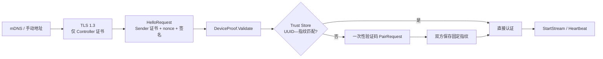

# ListenSphere R1 协议冻结与文档校准报告

## 验收结论

R1 已通过。生产 protobuf、协议常量、控制通道、DeviceProof 和 UDP 包头均未修改；
本阶段只变更文档、测试、测试资源接线和固定向量。

## 实际修改

- 将协议文档从旧草案校准为当前 Windows/Android wire contract。
- 明确 Controller 的 TLS 1.3 不请求客户端证书；Sender 身份由 TLS 通道内的
  `HelloRequest` DeviceProof 证明。
- 明确 TLS 会话身份、ListenSphere 设备身份、Trust Store 三层边界。
- 记录 DeviceProof 的上下文、Controller 指纹、.NET Guid 字节序、nonce 和签名算法。
- 记录无线、蓝牙和原生 USB 的握手差异，以及 Android 1.0/Windows 1.1 的 Minor 兼容现状。
- 冻结所有 protobuf 字段号、类型、oneof、枚举值和当前 reserved 状态。
- 新增 Windows/Android 共用的 Hello、DeviceProof 载荷和固定 RSA 签名向量。
- 增加显式无客户端证书 TLS Hello、DeviceProof 负向矩阵和跨平台向量测试。

## 文件变更

- `docs/protocol/listensphere-protocol-v1.md`
- `protocol/test-vectors/control-schema-v1.txt`
- `protocol/test-vectors/device-proof-payload-v1.txt`
- `protocol/test-vectors/hello-envelope-v1.hex`
- `tests/ListenSphere.Protocol.Tests/ProtocolCompatibilityTests.cs`
- `tests/ListenSphere.Core.Tests/DeviceProofTests.cs`
- `tests/ListenSphere.Core.Tests/NetworkControlTests.cs`
- 两个 .NET 测试项目文件：仅复制固定向量。
- Android `build.gradle.kts`：仅将仓库固定向量加入 unit-test resources。
- Android `ProtocolCompatibilityVectorTest.kt`。

R0 和 R2 第 1 批的未提交改动均被保留，本阶段没有覆盖或回退它们。

## 架构与身份流程

蓝牙和原生 USB 跳过 TLS，但先取得 Controller X.509 证书指纹，再进入相同的
Hello、DeviceProof、验证码和 Trust Store 语义。

## 行为变化

- 无生产行为变化。
- 无 protobuf message、字段号、枚举值或 wire bytes 变化。
- 无 TLS、Hello、Pairing、Trust Store、UDP、蓝牙或 USB 运行时代码变化。
- Android 仅新增测试资源目录，不进入 APK 运行时逻辑。

## 自动测试

- `dotnet restore ListenSphere.sln`：通过。
- `dotnet build ListenSphere.sln -c Release --no-restore -m:1`：0 警告、0 错误。
- .NET：93 项通过，0 失败。
  - Architecture：2
  - Core：52
  - Protocol：14
  - Windows Technical：25
- Android `assembleDebug testDebugUnitTest --no-daemon`：成功。
- Android：25 项通过，0 失败、0 错误、0 跳过。
- Debug APK：已生成于 Gradle 输出目录。
- 日志与 TRX：`TestResults/R1/`，已被 Git 忽略。

新增测试覆盖：

- TLS 1.3 客户端不提供证书仍可发送合法 Hello 并收到 `HelloResponse`。
- DeviceProof 正确签名通过；错误 Controller 指纹、nonce、签名、设备 UUID 或
  证书指纹均失败。
- 已有端到端用例继续覆盖首次验证码、已信任重连无需验证码、主动断开保留信任、
  撤销后重新要求配对。
- Major 不兼容拒绝、Minor 差异兼容、未知字段保留、4 字节大端长度、1 MiB 上限、
  UDP 60 字节头和跨平台 Hello wire 均被固定。

## 人工测试

R1 没有生产行为变更，不要求新增设备人工回归。R2 第 1 批的无线、蓝牙、USB
人工传输回归仍处于待验收状态。

## 已知风险

- 首次配对仍以用户观察到的六位验证码和可信局域网为前提，主动转发攻击仍是 MVP
  剩余风险。
- `PairRequest.sender_nonce` 与 `PairResponse.controller_nonce` 当前未参与密钥派生，
  已在文档中明确，未在 R1 擅自改变协议。
- 当前 protobuf 没有 reserved 项；未来删除字段时必须同时 reserved 编号和名称。
- Android 无线端当前发送 Minor 1.0，Windows 当前发送 1.1；现有 Major 兼容与未知
  字段保留测试保证互通，但后续应统一版本声明。
- 固定签名向量的测试证书有效期截至 2040-01-01，仅用于单元测试且不含私钥。

## 阶段是否通过

- R1：通过。
- R2：仍为 1/7 批自动化门禁通过、人工验收待完成。
- R3：未开始。
