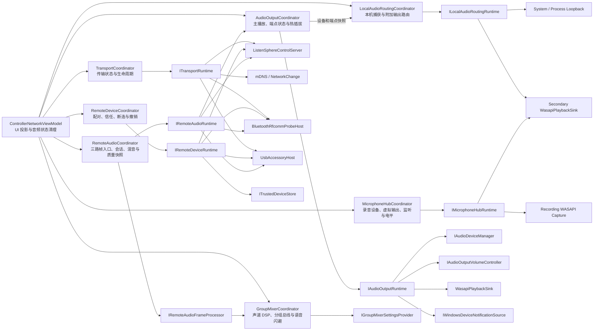

# ListenSphere R2 进度报告

## 当前结论

- R2 总进度：`7/7` 批全部完成，自动化门禁与最终人工验收均已通过。
- 已完成职责域：`TransportCoordinator`、`RemoteDeviceCoordinator`、
  `AudioOutputCoordinator`、`LocalAudioRoutingCoordinator`、
  `MicrophoneHubCoordinator`、`RemoteAudioCoordinator`、`GroupMixerCoordinator`。
- 未开始职责域：无。
- R1 已完成并建立 wire contract、TLS/Hello/DeviceProof 和 protobuf 兼容门禁。
- R2 当前没有修改 protobuf、UDP 包头、配置结构、Android 行为或公开接口。

## 第 1 批：TransportCoordinator

- 接管控制服务与 mDNS 生命周期、网络地址实时刷新和 1 秒防抖重发。
- 接管蓝牙监听、不可用状态、3 秒自动恢复和 USB 监听状态。
- 接管无线、蓝牙、有线模式选择，以不可变 `TransportSnapshot` 发布状态。
- 通过 `ITransportRuntime` 隔离 Windows 运行时，Coordinator 不依赖 WPF、
  Dispatcher 或 `ObservableCollection`。
- 新增 5 项技术测试。

## 第 2 批：RemoteDeviceCoordinator

- 接管 5 分钟单次配对码的生成、倒计时、消费完成和过期状态。
- 接管可信设备读取、排序和不可变 `RemoteDeviceSnapshot` 发布。
- 接管主动断连编排，保持无线控制、蓝牙 RFCOMM、原生 USB 三路均被关闭。
- 接管删除确认生命周期与设备信任撤销；取消或关闭时清理等待状态。
- 通过 `IRemoteDeviceRuntime` 隔离信任存储及三种连接运行时。
- ViewModel 仍负责声道、附加输出、EQ、动态处理和混音状态清理，避免本批扩大
  到后续 AudioOutput/RemoteAudio 职责域。
- 新增 6 项技术测试：信任排序、配对码格式、配对消费、三路断连、确认撤销、
  取消零副作用。
- 人工回归发现附加输出删除后两个卡片不同步：配置已经删除，但 WASAPI 路由释放
  会阻断输出设备卡片重建。现改为先同步两个 UI 投影和设置，再释放旧端点；释放
  失败仅记录日志，不再留下卡片残影，并增加 1 项异常释放回归测试。

## 第 3 批：AudioOutputCoordinator

- 接管 Windows 播放设备枚举、默认设备跟随、手动主输出选择和热插拔 600 ms 防抖。
- 成为主播放 `IAudioPlaybackSink` 的唯一所有者，统一启动、切换、写入失败恢复和释放。
- 接管主输出与各端点音量/静音快照，以及 120 ms 音量写入防抖。
- 启动时继续以 Windows 当前端点音量为准；应用音频设置时保留既有显式写回语义。
- 通过不可变 `AudioOutputSnapshot` 投影播放设备和端点状态；ViewModel 不再持有
  播放锁、输出音量控制器、热插拔 token 或主播放 sink。
- 附加输出的“设备状态”来自协调器，但路由成员关系和 SecondaryPlaybackRoute
  仍留给第 4 批 `LocalAudioRoutingCoordinator`。
- 保留 `playback.endpoint.ready/failed`、`playback.write.failed`、
  `playback.unexpected-stop` 和 `windows.audio-device.changed` 诊断事件。
- 新增 6 项技术测试：默认选择、手动切换、设置音量恢复、端点音量防抖、
  热插拔合并及写入失败恢复。
- 第 4 批人工验收发现输出设备下拉框可能为空：并发的手动刷新与 Windows 默认
  设备通知会让 `SelectedDevice` 保留上一轮枚举对象，而设备列表已经换成新对象。
  现以同一串行门禁保护刷新和手动选择，并把选择归一化到当前快照实例；新增
  1 项并发刷新回归测试。

## 第 4 批：LocalAudioRoutingCoordinator

- 接管本机系统 loopback、应用进程 loopback、附加输出播放实例、路由配置和捕获
  生命周期，成为这些运行时资源的唯一所有者。
- 通过 `ILocalAudioRoutingRuntime` 隔离 WASAPI 捕获与播放；Coordinator 不依赖
  WPF、Dispatcher 或 `ObservableCollection`。
- 使用不可变 `LocalAudioRoutingSnapshot` 同时投影应用卡片和输出设备卡片，删除
  路由时先发布权威空状态，再异步释放捕获与播放资源，避免两处卡片不同步。
- 保留稳定 Channel ID、`AudioOutputRouteSettings` 持久化结构、本机音源增益、
  拖动/添加/删除附加输出和主输出不能作为附加输出的既有语义。
- 播放设备或 Windows 默认输出变化时由 `AudioOutputCoordinator` 快照显式驱动
  本地路由重建；ViewModel 不再枚举或直接持有附加输出 sink。
- 新增 4 项技术测试：保存路由恢复与系统捕获、删除同步及资源释放、应用进程捕获
  生命周期、本机音源增益写入。

## 第 5 批：MicrophoneHubCoordinator

- 接管 Windows 录音设备枚举、默认麦克风切换、虚拟录音渲染端点识别与配对录音
  端点状态，成为麦克风设备状态的唯一所有者。
- 接管电脑麦克风 WASAPI 捕获、远程麦克风虚拟输出、扬声器监听、静音/总音量、
  30 Hz 电平聚合及全部播放/捕获资源释放。
- 通过 `IMicrophoneHubRuntime` 隔离录音设备管理、录音捕获和播放端点；Coordinator
  不依赖 WPF、Dispatcher 或 `ObservableCollection`。
- 使用不可变 `MicrophoneHubSnapshot` 投影两个设备选择框、启用/监听状态、音量、
  电平和错误；电平更新不再重建下拉框集合，也不会重复覆盖其他音频状态。
- 设备选择框改为按稳定设备 ID 选中，并由快照显式提供显示名称，避免自定义
  `ComboBox` 模板或设备集合刷新后出现“已选中但文本空白”。
- 麦克风设备刷新与三个设备选择操作共用串行门禁，避免选中项引用脱离最新设备
  快照；切换 Windows 默认麦克风失败时恢复原选择并重启原捕获。
- 本地路由与麦克风路由共用 `SecondaryPlaybackRoute`，端点停止或释放失败只记录
  日志，不阻断 UI 和其他音源清理。
- 新增 5 项麦克风中枢测试：默认关闭与设备识别、电脑捕获双路写入及增益、禁用
  清理、Windows 默认麦克风切换与捕获重启、失败回滚；保留 1 项异常释放测试。

## 第 6 批：RemoteAudioCoordinator

- 接管 UDP、Bluetooth RFCOMM 和原生 USB 三路音频读取循环，以及 PCM16 单/双声道
  到 Float32 立体声的统一转换与畸形帧校验。
- 成为远程音频会话、`RemotePcmMixer`、10 ms 播放时钟、主限幅器、30 Hz 电平节流
  和四个后台循环的唯一所有者；会话注册、移除与释放均经统一入口完成。
- 通过 `IRemoteAudioFrameProcessor` 调用现有声道 EQ、动态、分组、附加输出和麦克风
  路由，协调器只编排处理顺序；这些 DSP 算法留给第 7 批迁移，避免职责交叉。
- 每秒发布不可变 `RemoteAudioSnapshot`，由 ViewModel 在 UI 线程更新声道质量、电平
  和蓝牙双链路提示；实时音频循环不再直接操作 Dispatcher。
- 固定无线质量统计口径：真实估算丢包、补偿帧、接收队列溢出、混音队列溢出、
  抖动和缓冲分别保留，状态文字不再用单一“队列溢出”混淆不同根因。
- 新增 8 项技术测试：单/双声道转换、畸形帧、幂等启动与取消、主混音路由、
  麦克风旁路、会话清理，以及 1205 丢包/720 补偿场景的统计独立性。

## 第 7 批：GroupMixerCoordinator

- 接管每个远程会话的 `ChannelDynamicsProcessor`、声道/分组 `GraphicEqualizer`、
  动态结果、`VoiceDuckingController` 和处理器清理，成为 DSP 状态唯一所有者。
- 固定处理顺序为预增益/门限/压缩、声道 EQ、分组 EQ、声道×分组×闪避增益、
  声道限幅；保留现有 10 段 EQ、动态参数、预设和设置格式。
- Group Bus 音量、静音、EQ 和活动声道计数写入协调器，并以不可变
  `GroupMixerSnapshot` 投影回原有分组卡片。
- `IRemoteAudioFrameProcessor` 只调用协调器并继续编排附加输出、虚拟麦克风和监听；
  ViewModel 通过 `IGroupMixerSettingsProvider` 提供无分配的只读声道设置值快照。
- 会话断开、删除、传输切换或退出时，同时释放远程 Mixer 与 DSP 处理器状态，避免
  重连后沿用上一会话的门限、压缩、EQ 滤波器或闪避包络。
- 新增 8 项技术测试：未知会话旁路、声道/分组增益、分组静音、限幅顺序、门限状态、
  语音闪避、总线快照/计数和会话状态释放。

## 文件变更

- `apps/ListenSphere.Controller/Coordinators/TransportCoordinator.cs`：
  11,351 B / 344 行。
- `apps/ListenSphere.Controller/Coordinators/RemoteDeviceCoordinator.cs`：
  11,322 B / 345 行。
- `apps/ListenSphere.Controller/Coordinators/AudioOutputCoordinator.cs`：
  25,931 B / 749 行。
- `apps/ListenSphere.Controller/Coordinators/LocalAudioRoutingCoordinator.cs`：
  21,140 B / 550 行。
- `apps/ListenSphere.Controller/Coordinators/MicrophoneHubCoordinator.cs`：
  26,563 B / 728 行。
- `apps/ListenSphere.Controller/Coordinators/SecondaryPlaybackRoute.cs`：
  1,367 B / 47 行。
- `apps/ListenSphere.Controller/Coordinators/RemoteAudioCoordinator.cs`：
  18,449 B / 502 行。
- `apps/ListenSphere.Controller/Coordinators/GroupMixerCoordinator.cs`：
  7,291 B / 210 行。
- `apps/ListenSphere.Controller/ControllerNetworkViewModel.cs`：
  从 R0 的 183,526 B / 4,871 行降至 124,833 B / 3,375 行。
- `apps/ListenSphere.Controller/MainWindow.xaml`：179,304 B / 2,317 行；设备选择框
  使用稳定 ID 与显式显示文本，同时保留普通下拉框的默认显示行为。
- `apps/ListenSphere.Controller/Properties/AssemblyInfo.cs`：仅向 Windows 技术测试
  暴露内部实现。
- `tests/ListenSphere.Windows.TechnicalTests/TransportCoordinatorTests.cs`：5 项。
- `tests/ListenSphere.Windows.TechnicalTests/RemoteDeviceCoordinatorTests.cs`：6 项。
- `tests/ListenSphere.Windows.TechnicalTests/AudioOutputCoordinatorTests.cs`：6 项。
- `tests/ListenSphere.Windows.TechnicalTests/LocalAudioRoutingCoordinatorTests.cs`：4 项。
- `tests/ListenSphere.Windows.TechnicalTests/MicrophoneHubCoordinatorTests.cs`：5 项。
- `tests/ListenSphere.Windows.TechnicalTests/RemoteAudioCoordinatorTests.cs`：8 项。
- `tests/ListenSphere.Windows.TechnicalTests/GroupMixerCoordinatorTests.cs`：8 项。

R0、R1 尚未提交的卫生、文档、固定向量及兼容测试仍保留在工作区；R2 没有覆盖
或回退这些改动。

## 架构变化

传输状态、远程设备信任、主播放输出、本地附加路由、麦克风中枢、远程音频运行时
以及声道 DSP/分组混音分别只有一个 Coordinator 所有者。ViewModel 仅保留 WPF
集合/命令投影、设置映射和跨协调器编排，不再直接持有运行时音频处理器。

## 行为变化

- 无计划内的用户可见功能变化。
- 保留配对码 5 分钟有效、单次消费和原有状态文字。
- 保留可信设备按名称排序、同一设备多传输记录及取消删除行为。
- 保留主动断连不撤销信任、删除设备后必须重新配对的语义。
- 保留主控主动断开无线、蓝牙和 USB 后不自动抢连的既有运行时机制。
- 保留启动时以 Windows 主输出音量为准、手动选设备后关闭默认跟随、每端点独立
  音量/静音、蓝牙输出抗掉帧播放配置和设备变化后自动恢复行为。
- 保留应用与本地声音附加输出的添加、删除、持久化和进程重启捕获行为；路由删除
  后应用卡片与输出设备卡片使用同一快照，不再因端点释放耗时而出现残留。
- 保留麦克风中枢默认关闭、Windows 默认录音设备同步、电脑与远程麦克风混合、
  虚拟录音输出、可选扬声器监听、总音量/静音和设备设置跳转行为。
- 保留 UDP、蓝牙、USB 音频格式、缓冲目标、声道处理、附加输出和麦克风旁路行为；
  质量详情新增“补偿、接收溢出、混音溢出”独立标签，便于定位真实掉帧来源。
- 保留声道/分组音量、静音、10 段 EQ、门限、压缩、限幅、语音闪避和预设恢复；
  Group Bus 更新改由权威快照投影，实时 DSP 设置读取不再产生每帧对象或数组分配。

## 自动测试

- `dotnet build ListenSphere.sln -c Release --no-restore -m:1`：
  0 警告、0 错误。
- 全量 .NET：132 项通过，0 失败。
  - Architecture：2
  - Core：52
  - Protocol：14
  - Windows Technical：64
- Android `assembleDebug testDebugUnitTest --no-daemon`：成功，42 个任务完成。
- Android 单元测试：25 项通过，0 失败、0 错误、0 跳过。
- Debug APK：已生成于
  `apps/ListenSphere.Mobile/app/build/outputs/apk/debug/app-debug.apk`。
- .NET TRX：`TestResults/R2/batch-7/dotnet-trx/`，4 个文件、132 项全部通过。
- 首次 Android Wrapper 下载因 10 秒网络超时失败；随后使用本机已安装的
  Gradle 8.10.2、JDK 17、SDK 34 成功，未修改依赖版本。

## 人工测试

R2 七批人工验收全部通过，最终验收覆盖：

1. 调节任一声道音量、静音、EQ、门限、压缩和限幅，声音与动态状态文字立即响应。
2. 修改 Group Bus 音量、静音或 EQ 时，仅该分组声道受影响，声道数量与卡片显示正确。
3. 将语音声道设为闪避触发、游戏/媒体设为目标，讲话时目标平滑降低，停止后平滑恢复。
4. 应用声音的附加输出和手机麦克风的虚拟录音/监听仍收到处理后的正确音频。
5. 断开并重连同一设备后 EQ、门限、压缩和闪避状态正常，不出现旧滤波状态或静音残留。
6. 快速拖动声道与分组音量时不闪回，卡片电平/边框流畅，播放无明显爆音或停顿。
7. 保存设置并重启，声道分组、预设、10 段 EQ 和所有动态参数保持一致。
8. 同时播放多个无线/蓝牙/USB 声道时，质量统计与输出路由正常且应用可干净退出。

## 已知风险

- 无线音频的历史异常已完成统计口径校准，但尚需真实设备复现才能判断根因是网络
  丢包、接收溢出、混音溢出还是发送/调度停顿；自动测试不证明现场问题已消失。
- `ControllerNetworkViewModel.cs` 仍为 125 KB，尚未达到小于 30 KB 的长期治理目标；
  剩余体积主要来自同文件内的 WPF 卡片 ViewModel、设置/路由映射和 UI 命令，运行时
  音频职责已经完成提取。后续应按 UI 模型职责继续拆文件，不回退 Coordinator。
- Group Mixer 的处理顺序、状态生命周期和真实设备听感已完成本阶段验收；更长时间
  多声道压力、驱动独占兼容性仍属于后续稳定性测试范围。
- Android 仍有既有的 `android.overridePathCheck` 实验选项和 SDK XML 版本提示，
  不影响本批通过。

## 阶段是否通过

- R2 第 `7/7` 批：自动化门禁与人工验收均通过。
- R2 整体：通过，可以开始 R3 表现层治理。
