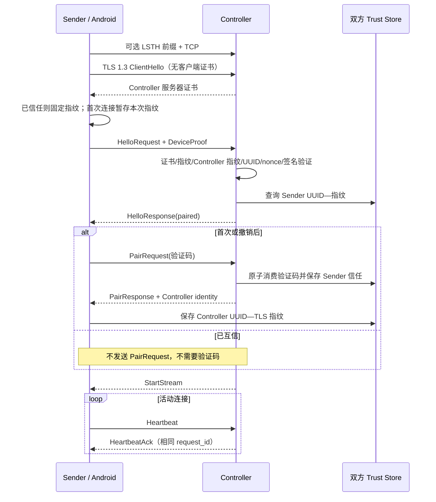

# ListenSphere Protocol v1 冻结基线

本文记录 R1 时 Windows 与 Android 已部署实现的 wire contract。除明确标注的
实现差异外，本文不描述未来设计；代码与固定向量共同构成兼容性基线。

## 1. 范围和版本

ListenSphere Protocol 是与语言和平台无关的局域网协议。v1 包含发现、控制、配对和音频数据报规范。

- Protobuf 包：`listensphere.protocol.v1`
- 当前版本：`1.1`
- Major 不一致：立即拒绝并返回 `INCOMPATIBLE_VERSION`
- Major 相同、Minor 不同：保留未知字段，通过能力位协商
- 删除 Protobuf 字段后必须同时保留字段编号和名称
- 所有长度在分配内存前校验

## 2. 设备发现

主控端使用 mDNS/DNS-SD 发布 `_listensphere._tcp.local.`。

SRV：

- Target：主控端局域网主机名
- Port：TLS 控制通道端口
- TTL：建议 120 秒；每 60 秒刷新

TXT：

| Key | 含义 | 示例 |
|---|---|---|
| `pv` | 协议 Major.Minor | `1.1` |
| `id` | 小写 UUID | `00112233-4455-6677-8899-aabbccddeeff` |
| `name` | UTF-8 用户可见设备名，最长 64 字节 | `游戏主机` |
| `platform` | 平台标识 | `windows` |
| `caps` | 十六进制能力位 | `0000000000000005` |

TXT 不发布验证码、IP、证书私钥、会话密钥或应用列表。高级设置允许手动输入 IP/主机名和控制端口，但不定义第二套广播协议。

## 3. 控制通道

- 传输：TCP + TLS 1.3
- TLS 服务器身份：Controller 使用安装时生成并持久保存的自签名证书
- TLS 客户端证书：不请求；Controller 设置 `ClientCertificateRequired = false`
- 帧：4 字节大端无符号长度，随后是一个 Protobuf `Envelope`
- 最大控制消息：1 MiB
- `request_id`：请求方生成，用于关联响应；通知可为 0

控制通道负责配对、心跳、能力协商、开始/停止流、会话密钥传递、设备状态和错误消息。不得在控制通道传送连续 PCM。

无线客户端可在 TLS ClientHello 前发送 5 字节传输前缀：ASCII `LSTH` 加模式字节
（1=Wireless、2=Bluetooth、3=Wired）。未发送前缀时 Controller 默认按 Wireless
处理；该前缀只记录传输来源，不参与身份认证。

### 3.1 三层身份模型

| 层 | 证明内容 | 当前实现 |
|---|---|---|
| TLS 会话身份 | 当前连接中的 Controller 证书 | 首次连接临时接受并读取 SHA-256 指纹；已有本地信任时在 TLS 握手阶段固定指纹 |
| ListenSphere 设备身份 | Sender 持有 `HelloRequest.device_certificate` 对应私钥 | TLS 通道内的 `identity_signature`；不依赖 TLS client certificate |
| Trust Store | 用户曾确认该设备 UUID 与证书指纹绑定 | 首次验证码成功后双方保存；撤销会删除 Controller 侧记录并断开活动连接 |

Controller 身份由 TLS 服务器证书提供。Sender 还必须确认 `HelloResponse.controller`
的 UUID 与发现目标一致，并确认其中的 `certificate_fingerprint` 与本次 TLS 证书
指纹一致。首次连接在验证码成功后保存该指纹；后续连接在 TLS 握手阶段直接固定。

Sender 身份由 `DeviceProof` 证明。签名载荷严格按下列顺序拼接，不包含长度前缀：

```text
ASCII("ListenSphere-Device-Proof-v1\0")
|| controller_certificate_sha256[32]
|| sender_device_id_dotnet_guid_bytes[16]
|| client_nonce[32]
```

Windows RSA 身份使用 SHA-256 + PKCS#1 v1.5；Android P-256 身份使用
SHA256withECDSA DER 签名。UUID 使用当前 protobuf 中既有的 .NET `Guid.ToByteArray()`
顺序，不得改成 RFC 4122/network order。

Controller 的 Hello 验证顺序是：结构长度 → 解析并检查证书有效期 → 证书原始字节
SHA-256 与 `DeviceIdentity.certificate_fingerprint` 恒定时间比较 → 使用当前 Controller
指纹、设备 UUID 和 nonce 重建载荷 → 验签。证明通过后才检查 Hello 的协议 Major、
查询 Trust Store 并返回 `HelloResponse`。

### 3.2 无线握手状态图



Windows Sender 当前每 2 秒发送心跳，并以 6 秒读取超时判断故障；Android 当前每
5 秒发送心跳，套接字读取超时为 15 秒。心跳周期不是 protobuf 字段，兼容实现不得
假设只有一个固定周期。

P4 的 `StartStream` 由 Controller 在设备认证完成后发送，包含随机 SessionId、非零 StreamId、AES-256-GCM 临时密钥、4 字节 salt、UDP 端口和固定音频格式。密钥只存在于当前 TLS 连接及内存中；控制连接断开、设备撤销或流重启时立即作废。

从 v1.1 起，认证后的 Sender 可通过 `OpenAudioStream` 为每个应用或系统捕获源声明独立逻辑声道。Controller 返回 `AudioStreamOpened`，其中包含稳定 `channel_id` 和该声道独享的 `StartStream` 会话；`CloseAudioStream` 只关闭指定声道，不断开设备控制连接。一个应用的多进程可以在 Sender 内部先混合，但不同应用不得在发送前混成同一流。旧版 Sender 仍可继续使用认证后自动下发的默认单流。

### 3.3 认证后的控制序列

1. TLS 1.3 完成后首个 protobuf 必须是 `HelloRequest`；没有 TLS client certificate。
2. Controller 验证 DeviceProof，检查 Major，并返回该 UUID/指纹是否受信任。
3. 未受信任设备发送 `PairRequest`；成功后 Controller 返回 `PairResponse`。
4. Controller 下发默认 `StartStream`；Sender 可继续用 `OpenAudioStream` 声明应用声道。
5. `HeartbeatAck` 回显 `Heartbeat` 的单调时间值并复用请求的 `request_id`。
6. `CloseAudioStream` 只关闭指定声道；`Disconnect` 或底层断开关闭设备全部声道。

Android 无线端当前发出版本 1.0，Windows 当前版本为 1.1；两者 Major 相同，依靠
protobuf 未知字段保留继续兼容。`Envelope` 的字段 1、2、10–21 及所有嵌套消息字段
均已冻结在 `protocol/test-vectors/control-schema-v1.txt`。当前 schema 尚无 reserved
范围或名称；未来删除任何字段时必须同时 reserved 原编号和名称，绝不复用。

### 3.4 蓝牙与原生 USB

RFCOMM 和 Android Open Accessory 不运行 TLS。它们先从 Controller 的传输握手读取
X.509 证书，计算 SHA-256 指纹，再发送与无线模式相同的 `HelloRequest` DeviceProof。
后续 Hello、首次验证码、Trust Store 固定和格式协商语义相同，但音频帧封装及可用
codec 属于各自传输，不使用无线 UDP 包头。

## 4. 配对

1. 主控端首次运行生成 TLS 身份和稳定设备 UUID。
2. 发送端通过 mDNS 或手动地址找到主控端并建立 TLS 连接；首个 protobuf 必须是 Hello。
3. 主控端生成六位十进制验证码，显示 5 分钟；同一来源最多连续失败 5 次，随后冷却 10 分钟。
4. 用户在发送端输入验证码。
5. `PairRequest` 携带发送端身份、32 字节 `sender_nonce` 和验证码。当前 Controller
   以已验证 Hello 的 UUID/指纹作为信任依据；PairRequest 的身份和 nonce 不构成第二次证明。
6. 主控端原子地消费验证码，记录 Hello 中的设备 UUID 与证书指纹，返回 32 字节
   `controller_nonce`。当前 nonce 为保留的握手材料，尚未参与密钥派生。
7. 发送端保存主控端指纹；双方后续连接都必须校验固定身份。
8. 撤销后删除信任记录和现有会话密钥，强制断开活动连接。

验证码不是长期密钥。首次配对模型以可信局域网和用户观察主控端屏幕为前提；主动转发攻击是 MVP 的剩余风险，后续可增加双端短认证字符串确认。

## 5. 无线 UDP 音频格式

默认协商值：

| 属性 | v1 默认 |
|---|---|
| Sample rate | 48,000 Hz |
| Sample format | IEEE 754 Float32 little-endian |
| Channels | 2，交错立体声 |
| Frame duration | 10 ms（480 sample frames） |
| Optional frame duration | 20 ms（960 sample frames） |
| Codec | PCM Float32 |

Opus 的编号已保留，但 MVP 不发送 Opus。时间戳表示从流起点开始的 sample frame 数，不使用墙上时钟。

## 6. UDP 音频包头

所有多字节整数均为小端。固定头为 60 字节，最大 UDP 数据报为 1,200 字节。

| Offset | Size | 字段 |
|---:|---:|---|
| 0 | 4 | ASCII `LSPA` |
| 4 | 1 | MajorVersion |
| 5 | 1 | MinorVersion |
| 6 | 2 | Flags；bit 0 表示 AES-GCM |
| 8 | 2 | HeaderLength，v1 固定 60 |
| 10 | 1 | Codec；1=PCM Float32，2=Opus（保留） |
| 11 | 1 | SampleFormat；1=Float32 LE |
| 12 | 1 | ChannelCount |
| 13 | 1 | Reserved，必须写 0 |
| 14 | 4 | SampleRate |
| 18 | 2 | FrameSamples |
| 20 | 1 | FragmentIndex，从 0 开始 |
| 21 | 1 | FragmentCount，至少 1 |
| 22 | 16 | RFC 4122/network-order SessionId UUID |
| 38 | 4 | StreamId |
| 42 | 4 | PacketSequence |
| 46 | 4 | FrameSequence |
| 50 | 8 | Timestamp，单位为 sample frame |
| 58 | 2 | PayloadLength |

校验顺序：数据报最小长度 → Magic → Major → HeaderLength → 枚举和格式范围 → 分片范围 → 精确 PayloadLength → SessionId/StreamId → AEAD → 去重/重组。失败包直接丢弃并只增加聚合计数。

`PacketSequence` 每个数据报递增并允许 `uint32` 自然回绕；`FrameSequence` 每个完整音频帧递增。一个帧的全部分片共享 SessionId、StreamId、FrameSequence、Timestamp 和格式。

## 7. 分片和重组

- 单片明文预算由 `1200 - 60 - 16` 计算；16 字节为 AES-GCM Tag。
- FragmentCount 最大 255；超过限制的帧不得发送。
- 重组键为 `(SessionId, StreamId, FrameSequence)`。
- 重复 FragmentIndex 丢弃。
- 缺片超过抖动窗口后丢弃整帧并输出等长静音。
- 不等待过期帧，不允许缺帧导致缓冲无限增长。

## 8. 音频加密

控制通道在认证成功并开始流时传递随机 256 位会话密钥和 4 字节 session salt。每个数据报使用 AES-256-GCM：

- Nonce：`session salt (4) || StreamId LE (4) || PacketSequence LE (4)`
- AAD：完整 60 字节包头
- Payload：ciphertext 后接 16 字节 authentication tag
- PayloadLength：包含 ciphertext 和 tag

同一密钥下不得复用 `(StreamId, PacketSequence)`；流重启或序号可能重用前必须协商新密钥。认证失败的负载不得进入重组或音频队列。

## 9. 错误与隐私

稳定错误码在 `control.proto` 中定义。未知错误码显示通用中文错误，同时保留数值用于诊断。

协议日志允许记录版本、匿名会话关联号、延迟、丢包、缓冲欠载/溢出和错误码；禁止记录 PCM、验证码、会话密钥、私钥、完整证书、未过滤的设备名或应用列表。

## 10. 测试向量

`protocol/test-vectors/audio-header-v1.hex` 是固定 v1 包头的跨语言十六进制测试向量。UUID 使用 RFC 4122 字节顺序，其余多字节字段使用小端。未来客户端必须能解析该向量并重新生成完全相同的 60 字节结果。

- `control-schema-v1.txt`：protobuf message、field number、类型、oneof、reserved 与枚举快照。
- `hello-envelope-v1.hex`：包含 Android 风格 Hello 字段的确定性 protobuf wire 向量。
- `device-proof-payload-v1.txt`：Controller 指纹、.NET UUID 字节序、nonce、完整
  签名载荷、SHA-256、测试证书、公钥指纹和固定 RSA 签名；不包含私钥。

.NET 和 Android 单元测试必须共同读取后两项向量。任何有意变更都必须先提升协议
版本、给出迁移策略并通过跨平台评审；不得通过自动更新快照掩盖 wire 差异。
